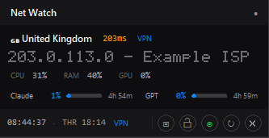

# net-watch-widget

An always-on-top desktop widget for Windows that answers, at a glance:
**am I on the VPN, is the connection healthy, and how much of my AI plan is
left?**

One Python file. One PowerShell command to install. Starts automatically
with Windows and stays out of the way.



---

## Contents

- [What it shows](#what-it-shows)
- [Requirements](#requirements)
- [Install](#install)
- [Using it](#using-it)
- [Configuration](#configuration)
- [AI usage tracking](#ai-usage-tracking)
- [Restarting after an edit](#restarting-after-an-edit)
- [Uninstall](#uninstall)
- [Troubleshooting](#troubleshooting)
- [Privacy and security](#privacy-and-security)
- [How it works](#how-it-works)
- [License](#license)

---

## What it shows

**Compact mode** — a single strip: country flag and name, ping, VPN state,
public IP, ISP, CPU / RAM / GPU, AI usage bars, clock.

**Full mode** — everything above plus:

| Section | Contents |
|---|---|
| Network | public IP, local IP, gateway, DNS, hostname |
| Latency | round-trip time and packet loss to two hosts |
| Hardware | CPU, RAM, disk, network throughput |
| Timezone | system timezone against the timezone of your exit IP |
| AI usage | Claude and Codex quota percentages with reset countdowns |
| Quick checks | ISP, ASN, proxy/datacenter detection, DNS, a connection score |

The VPN indicator is not a guess from the IP alone: it cross-checks the
country reported by a geo-IP lookup against Cloudflare's own edge report, and
flags a mismatch between the two rather than trusting either one.

---

## Requirements

- Windows 10 or 11
- Python 3.9 or newer, with `tkinter` (included in the installer from
  [python.org](https://www.python.org/downloads/) — tick **Add python.exe to
  PATH** during setup)
- One dependency, `psutil`, which the installer installs for you

You do **not** need an API key, an account, or an internet-facing service.

---

## Install

```powershell
git clone https://github.com/shawnbhs/net-watch-widget.git
cd net-watch-widget
powershell -ExecutionPolicy Bypass -File .\install.ps1
```

That single command:

1. verifies Python and `tkinter` are present,
2. installs `psutil` if it is missing,
3. creates `.env` from `.env.example` (all settings optional),
4. registers the widget to start automatically at login,
5. starts it.

Re-running it is safe — it updates the autostart entry and leaves an existing
`.env` alone.

To set it up without autostart:

```powershell
powershell -ExecutionPolicy Bypass -File .\install.ps1 -NoAutostart
```

### Why `-ExecutionPolicy Bypass`

Windows blocks unsigned scripts by default. The flag applies to this one
invocation only and changes nothing system-wide. Read `install.ps1` first if
you would rather not take that on faith — it is about 150 lines and does
exactly what the list above says.

---

## Using it

- **Drag** anywhere on the widget to move it. Position is remembered.
- **Right-click** for the menu:

| Item | Does |
|---|---|
| Copy Public IP / Copy Local IP | to clipboard |
| Open on Map | opens the IP's approximate location |
| View History | the last IP changes, with timestamps |
| Open Log | the plain-text log file |
| Compact / Full | switch modes |
| Refresh | force an immediate update |
| Toggle Lock | pin the widget so it cannot be dragged |
| Quit | close it (autostart is unaffected) |

The footer buttons do the same for the common actions: menu, lock, network
toggle, refresh, close.

---

## Configuration

Everything is optional. **The widget runs correctly with no configuration at
all** — copy `.env.example` to `.env` only if you want to change something.

| Key | Default | What it does |
|---|---|---|
| `CLAUDE_CRED_PATHS` | `%USERPROFILE%\.claude\.credentials.json` | Where to find the Claude CLI's stored login |
| `CODEX_CRED_PATHS` | `%USERPROFILE%\.codex\auth.json` | Where to find the Codex CLI's stored login |
| `PING_HOST_1` | `1.1.1.1` | First latency target |
| `PING_HOST_2` | `8.8.8.8` | Second latency target |
| `LOG_FILE` | `%USERPROFILE%\ip_bar_log.txt` | Where the log is written |

Both credential keys accept several paths separated by `;` — the first
readable one wins. `~` and `%VARIABLES%` are expanded.

Restart the widget after editing `.env`; it is read once at startup.

---

## AI usage tracking

If you use the **Claude Code** or **OpenAI Codex** CLI, the widget shows how
much of your plan you have used, with a countdown to each reset.

It works by reading the OAuth token those CLIs already saved when you logged
in. There is no API key to paste, and the widget never sees your password.

**If you have not logged in to either CLI, the widget still works perfectly** —
the AI rows show `setup` and the note line reads *"please run 'claude' and log
in"*. Everything else keeps running. Nothing is polled, so there is no wasted
network traffic and no error spam in the log.

To enable it, log in to whichever CLI you use:

```powershell
claude    # then follow the login prompt
codex     # then follow the login prompt
```

The widget picks the credentials up on its next cycle (within 15 minutes), or
immediately if you hit **Refresh**.

### If you run the CLIs inside WSL

The tokens then live in your Linux home, not your Windows profile. Point the
widget at them in `.env`, replacing the distro and username:

```ini
CLAUDE_CRED_PATHS=\\wsl.localhost\Ubuntu\home\youruser\.claude\.credentials.json
CODEX_CRED_PATHS=\\wsl.localhost\Ubuntu\home\youruser\.codex\auth.json
```

---

## Restarting after an edit

Editing the file on disk does **not** change the running widget. Restart it:

```powershell
Get-Process pythonw -ErrorAction SilentlyContinue |
    Where-Object { $_.CommandLine -like '*ip_bar.py*' } | Stop-Process -Force
Start-Process pythonw.exe "$PWD\ip_bar.py"
```

Or just re-run `install.ps1`, which stops the old instance for you.

---

## Uninstall

```powershell
powershell -ExecutionPolicy Bypass -File .\install.ps1 -Uninstall
```

Removes the autostart entry and stops the widget. Delete the folder to remove
the files, and `%USERPROFILE%\ip_bar_log.txt` for the log.

---

## Troubleshooting

**Nothing appears after install.**
Run it in a console to see the error:

```powershell
python .\ip_bar.py
```

**"Python was not found"** — Python is not on `PATH`. Reinstall from
python.org with **Add python.exe to PATH** ticked, or open a new terminal if
you just installed it.

**AI rows say `setup`.** That is the expected state before you log in to the
Claude or Codex CLI. See [AI usage tracking](#ai-usage-tracking).

**AI rows say `err`.** A real failure, not a missing login. Check `Open Log`.
The usual cause is an expired refresh token — logging in to the CLI again
fixes it.

**AI rows say `VPN required`.** The AI providers block some regions, so the
widget refuses to send a request when it cannot confirm the exit IP is
outside a blocked one. Connect your VPN and hit Refresh.

**The widget does not start after a reboot.** Check the autostart entry
survived:

```powershell
Get-ItemProperty 'HKCU:\Software\Microsoft\Windows\CurrentVersion\Run' -Name IPBar
```

If it is missing, re-run `install.ps1`. If the path is wrong, just launch the
widget from its new location once — it rewrites its own autostart entry when
it notices a mismatch.

**Ping shows nothing.** Some networks block ICMP. Point `PING_HOST_1` at your
own gateway instead.

---

## Privacy and security

- **No telemetry.** Nothing about you is sent anywhere except the public API
  requests listed below, all of which you can see in the source.
- **No secrets in this repo.** `.env` is git-ignored, and the widget has no
  API key of its own.
- **Tokens are never logged, copied, or transmitted anywhere except the
  provider's own token endpoint** — `platform.claude.com` and
  `auth.openai.com`. The log records IP changes only.
- **Outbound requests**, in full: `myip.wtf` and `ipwho.is` (public IP),
  `ip-api.com` and `ipinfo.io` (ISP/ASN enrichment), `api.runflare.com`
  (second-opinion IP), `cloudflare.com/cdn-cgi/trace` (independent country
  check), and the two AI usage endpoints when a CLI is logged in.
- Two enrichment endpoints are plain HTTP because their free tier offers no
  HTTPS. They receive only a public IP address — never a credential — and
  their answers feed display fields only.
- Every scheme is checked before a request is opened, so no code path can be
  turned into a local file read.
- CI runs `semgrep`, `bandit`, `pip-audit`, `ruff`, and a full-history
  `gitleaks` scan on every push.

---

## How it works

One file, `ip_bar.py`, around 3,700 lines of `tkinter` with a single
dependency. Data is gathered on background threads, so a slow lookup never
freezes the UI; each panel updates as its own answer arrives.

The AI usage panel refreshes every 15 minutes with jitter, backs off
exponentially on failure, and stops entirely — no retries — when a provider
signals a region block. Poll rates are deliberately conservative: this is a
status widget, not a scraper.

Autostart is self-healing. On startup the widget compares its own path
against the stored `Run` key and rewrites it on a mismatch, so moving the
folder needs no reinstall.

---

## License

MIT — see [LICENSE](LICENSE).
